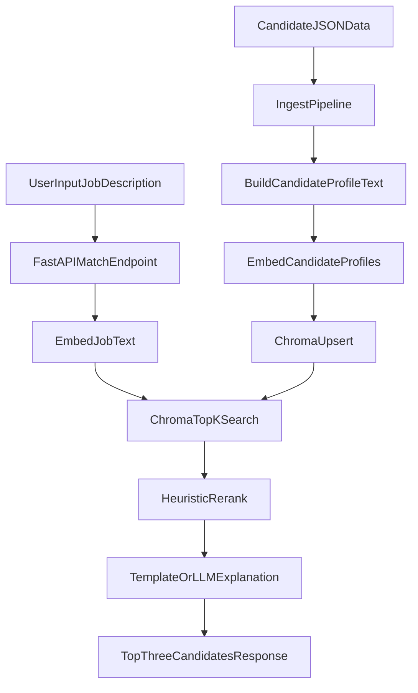

# Architecture

## Components

- `app/services/ingest.py`: load candidate JSON, build text, embed, store in Chroma.
- `app/services/match.py`: embed query, retrieve top-k, rerank, return top-n.
- `app/services/explain.py`: template explanation and optional LLM explanation.
- `app/api/main.py`: API routes and wiring.

## Design Decisions

- Local Chroma for zero-infra setup.
- LiteLLM-compatible models to allow provider swaps.
- Simple weighted score to keep logic transparent and tweakable.
